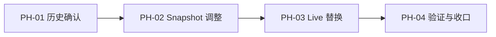
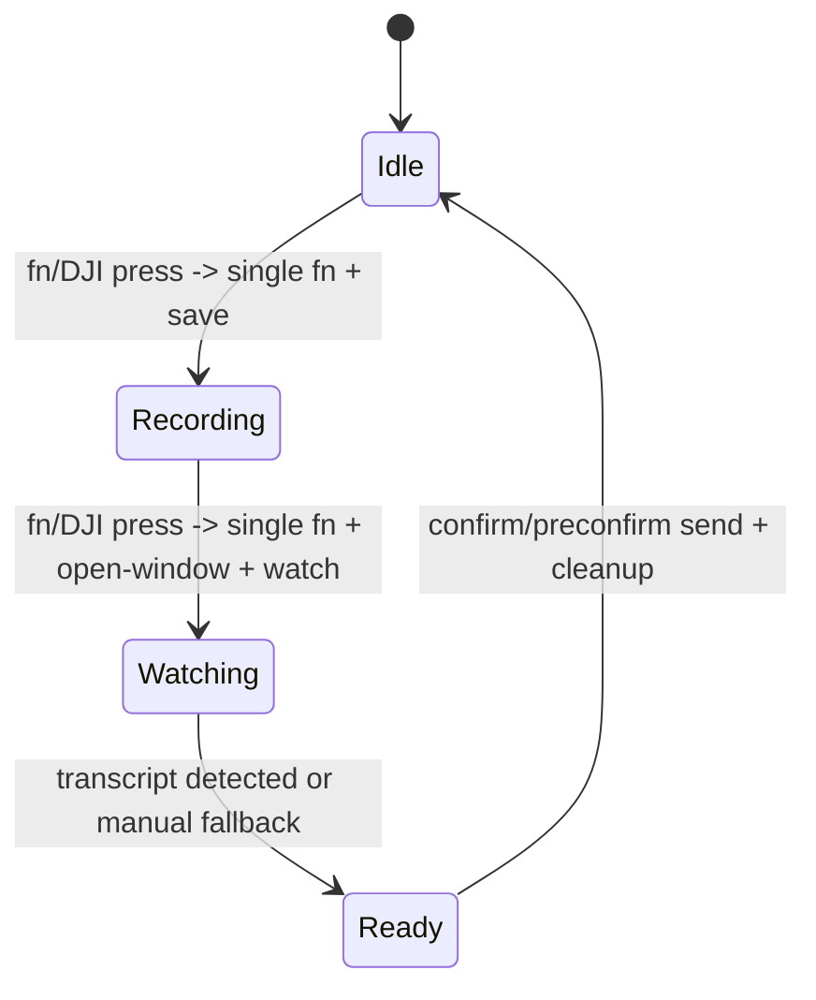

# 豆包单击 fn 录音状态机调整 - Visual Map

Visual Map Contract: v1.0

## 图表索引（Map Index）

| ID | Type | Purpose | Required For Understanding | Source Evidence | Promotion Candidate |
| --- | --- | --- | --- | --- | --- |
| MAP-01 | phase | 展示任务执行阶段和依赖 | yes | `task_plan.md`; `progress.md` | no |
| MAP-02 | state | 展示调整后的按键状态流 | yes | `snapshots/fn-dictation-rule.json` | no |

## 阶段关系图（Phase Graph）

## 阶段表（Phase Table，表头供 checker 解析）

| Phase ID | Depends On | State | Completion | Output | Required Evidence | Evidence Status | Blocking Risk | Owner / Handoff |
| --- | --- | --- | ---: | --- | --- | --- | --- | --- |
| PH-01 | none | done | 100 | 确认历史中无可直接恢复的单次 `fn` snapshot | git show/log | present | none | coordinator |
| PH-02 | PH-01 | done | 100 | 仓库 snapshot 和文档同步为 guard 包裹的单次 `fn` | JSON parse and diff | present | none | coordinator |
| PH-03 | PH-02 | done | 100 | live Karabiner rule 替换为 guard 包裹的单次 `fn` 版本 | live JSON inspection and backup path | present | none | coordinator |
| PH-04 | PH-03 | done | 100 | 证据和 closeout 记录完成 | progress / ledger / closeout | present | runtime smoke remains user-observed | coordinator |

## 状态流

## 证据状态

| 项目 | 状态 | 说明 |
| --- | --- | --- |
| 历史提交检查 | done | `git show` / `git log -S` 已查 |
| Snapshot 修改 | done | `fn-dictation-rule.json` 已改为 guard 包裹的单次 `fn` |
| JSON 检查 | done | snapshot 和 live JSON 均可解析 |
| Live 替换 | done | 已替换 `~/.config/karabiner/karabiner.json` 同名 rule |
| Live 冒烟 | deferred | 已运行 `micReset`，真实豆包录音效果需用户实际按键确认 |
